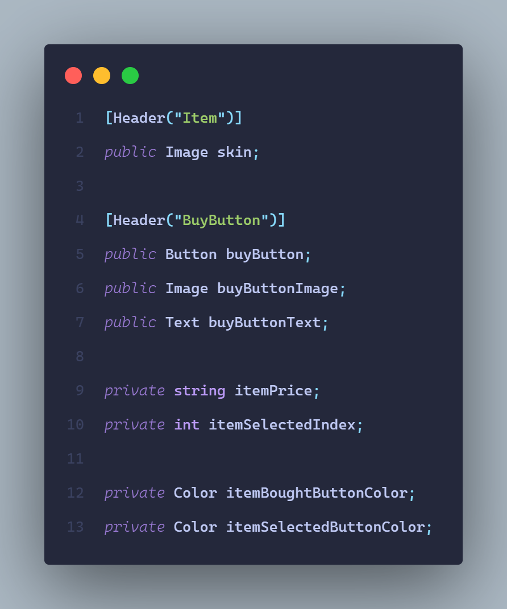

# Item-Shop
* Sistema de tienda con sistema de guardado y cargado de datos utilizando PlayerPrefs

---

# [Item](https://github.com/MarcoPaoletta/Item-Shop/blob/main/Assets/Scripts/Item.cs)

## Variables

---

## SetSelecteditem()

* `for` para la cantidad total de items: 6
* Obtenemos todos los items en la variable `item`
* Dentro de ese `item` obtenemos el componente `Text` dentro del `BuyButton` en la variable `itemBuyButtonText`
* De ese `item` obtenemos el componente `Image` dentro del `Skin` en la variable `skin`
* Si el texto del `itemBuyButtonText` es `SELECTED`, es decir, que el item es el seleccionado:
  * Cambiamos el `spriteRendererColor` del `Player` al `color` de la `skin` 
    > La variable `spriteRendererColor` es la encargada de determinar el color del `SpriteRenderer` del `Player`

---

## SetColors()

> La clase `ColorUtility` es una colección de funciones comunes para el color. Dentro de esta clase, existe la función `TryParseHtmlString` que intenta convertir un color html a un `Color` para, por ejemplo, poder cambiar los colores de los botones
* Teniendo esto en cuenta, creamos los colores correspondientes para ser utilizados

---

## StylizeSelectedItemButton()

> La clase `PlayerPrefs` guarda preferencias del jugador entre sesiones de juego, puede almacenar valores `string`, `float` e `int`
* Obtenemos el valor `ItemSelectedIndex` dentro de los `PlayerPrefs` en la variable `itemSelectedIndex`
* Creamos una variable `selectedItem` que va a buscar, gracias al `itemSelectedIndex`, el item que va a ser seleccionado
> Es decir, si `itemSelectedIndex` es 2, va a obtener el item 2
* Una vez que tenemos el `itemSelected`, cambiamos las propiedades de este correspondientes: `color` y `text`

---

## StylizeBoughtItemButton()

* `for` para la cantidad total de items: 6
* Obtenemos todos los items en la variable `item`
* Creamos una variable `itemIndex` en la cual usando el `item` solamente nos quedaremos con el indice que tiene el `item`
> El nombre de los items es `Item (0)`, `Item (1)` y asi sucesivamente. Con ayuda de la función `Replace`, eliminamos todos los caracteres del nombre del item quedándonos solo con el numero  
* Si la función `ItemBought` devolvió `true`:
  * Obtenemos el `BuyButton` dentro de la variable `buyButton`
  * Cambiamos las propiedades correspondientes del `BuyButton`   

---

## ItemBought

* Si el `itemIndex` que le pasamos cuando la llamamos es igual al `itemBoughtIndex` junto al `itemIndex` significa que el item se encuentra comprado, entonces devolvemos `true`
> Entre los valores que el `PlayerPrefs` guarda en este proyecto, se encuentran los valores `ItemBoughtIndex` y el indice del item que fue comprado. Es decir, si tenemos el item 3 comprado, el `PlayerPrefs` va a tener un valor llamado `ItemBoughtIndex3`

---

## OnBuyButtonClicked()

---

## ItemBoughtOrSelected()

* Si el texto del `BuyButton` es `BOUGHT` o `SELECTED`, es decir, el item se encuentra comprado o seleccionado, devolvemos `true`

---

## EnoughMoney()

* Si la cantidad de dinero que tenemos es mayor o igual al `itemPrice` devolvemos `true`

---

## BuyItem()

* Cambiamos el `color` y `text`
* Restamos la `moneyCount` al `itemPrice` para descontar la plata que gastamos en el objeto comprado

---

## SaveBoughtItems()

* `for` para la cantidad total de items: 6
* Obtenemos todos los items en la variable `item`
* Dentro de ese `item` obtenemos el componente `Text` dentro del `BuyButton` en la variable `itemBuyButtonText`
* De ese `item` obtenemos el componente `Image` dentro del `Skin` en la variable `skin`
* Si el texto del `itemBuyButton` es igual a `BOUGHT` o `SELECTED`:
  * Creamos una variable `itemIndex` en la cual usando el `item` solamente nos quedaremos con el indice que tiene el `item`
  * Guardamos el `itemIndex` usando `PlayerPrefs`

---

## SelectItem()

* `for` para la cantidad total de items: 6
* Obtenemos todos los items en la variable `item`
* Dentro de ese `item` obtenemos el componente `Text` dentro del `BuyButton` en la variable `itemBuyButtonText`
* Si el texto del `itemBuyButtonText` es igual a `SELECTED`, lo cambiamos a `BOUGHT` y luego lo cambiamos nuevamente a `SELECTED`
> Hacemos esto para "reiniciar" los textos y luego al que específicamente fue tocado le ponemos el texto correspondiente

---

## SetItemSelectedIndex()

* Creamos una variable `itemIndex` en la cual usando el `buyButtonText` solamente nos quedaremos con el indice que tiene el `item`
* El valor de `itemIndex` es un `string`, entonces usando `int.Parse` lo convertimos en un `int`
* Almacenamos ese valor usando `PlayerPrefs` 

---

## SetButtonsColor()

* `for` para la cantidad total de items: 6
* Obtenemos todos los items en la variable `item`
* Dentro de ese `item` obtenemos el componente `Text` dentro del `BuyButton` en la variable `itemBuyButtonText`
* De ese `item` obtenemos el componente `Image` dentro del `item` en la variable `itemBuyButtonImage`
* Si el texto del `itemBuyButton` es igual a `SELECTED` cambiamos el color del `itemBuyButtonImage` a `itemSelectedButtonColor`
* Si el texto del `itemBuyButton` es igual a `BOUGHT` cambiamos el color del `itemBuyButtonImage` a `itemBoughtButtonColor`

---

## SetSkinForThePlayer()

* `for` para la cantidad total de items: 6
* Obtenemos todos los items en la variable `item`
* Dentro de ese `item` obtenemos el componente `Text` dentro del `BuyButton` en la variable `itemBuyButtonText`
* De ese `item` obtenemos el componente `Image` dentro del `item` en la variable `itemBuyButtonImage`
* Si el texto del `itemBuyButton` es igual a `SELECTED` hacemos la variable `spriteRendererColor` que maneja el color del `SpriteRenderer` del `Player` sea igual al `color` de la `skin`

---

# Descargar Unity, ejecutar el proyecto y utilizar Visual Studio

## Descargar Unity
* Dirigirnos al [sitio oficial de descarga](https://unity.com/download) de Unity y descargar el hub como cualquier otra aplicacion simplemente tocando siguiente, siguiente, siguiente
* Una vez instalado, nos dirigimos  a la parte de `Installs`, luego en `ADD` e instalamos la version de Unity utilizada en este proyecto que es la `2020.3.28f1`
* Lo siguiente es seleccionar los modulos. El unico que vamos a seleccionar es el que dice `Microsoft Visual Studio Community` seguido de un año que puede ir cambiando
* Esperamos a que se instale y ya estaria

---

## Ejecutar el proyecto
* Nos dirigimos a la parte de `Installs`, luego en `OPEN` y abrimos la carpeta del proyecto la cual deberia de tener una carpeta con el nombre del proyecto, por ejemplo `John And Grunt` y otra con el nombre `My project`
* Con esto, ya tendremos el proyecto importado

---

## Utilizar Visual Studio
* Con todos los pasos anteriores ya se puede ejecutar y probar el proyecto, no obstante, no podemos realizar cambio en ningun script ya que Unity no tiene ningun IDE o editor de texto incluido
* Entonces, descargamos [Visual Studio](https://visualstudio.microsoft.com/es/downloads/) como cualquier otra aplicacion simplemente tocando siguiente, siguiente, siguiente
* Lo siguiente es seleccionar los modulos. Los modulos que vamos a seleccionar son: `.NET desktop development`  y `Game development with Unity`
* Vamos a algun proyecto de Unity, tocamos en `Edit` -> `Preferences` -> `External Tools` -> `External Script Editor` y seleccionamos `Microsoft Visual Studio Community` seguido de un año que puede ir cambiando
* Ahora, podremos modificar los scripts de Unity que son escritos en C#